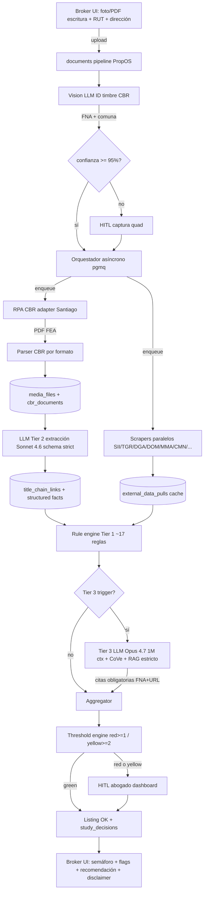

# 11 — AI feasibility y arquitectura del title-safeguard

> **Audiencia**: ingeniero senior PropOS. Caveman markdown denso. Snippets código y SQL en sintaxis normal.
> **Scope**: pipeline pre-listing que detecta propiedades con problemas de título antes de aceptar para venta. NO sustituye estudio formal abogado en cierre. Output broker = semáforo verde/amarillo/rojo + flags + remediación.
> **Glosario rápido**: CBR = Conservador de Bienes Raíces. FNA = Foja/Número/Año. CGP = Certificado Gravámenes y Prohibiciones. DV = Dominio Vigente. HITL = Human-In-The-Loop. CoVe = Chain-of-Verification.

---

## 0. TL;DR

- ~38 casos del `cases_taxonomy.csv` parten en 3 tiers. **~17 casos Tier 1** (regla determinística pura, sin LLM). **~14 casos Tier 2** (LLM extracción con schema validable). **~7 casos Tier 3** (LLM juicio + abogado revisa).
- Vision LLM por defecto producción: **Claude Sonnet 4.6** (97.6% extracción, 0.09% halucinación documental, $3/$15 por MTok). Razonamiento cadena larga: **Claude Opus 4.7** (1M context, $5/$25 por MTok). Dev: Cerebras Llama 3.3 free.
- Halucinación legal real LLM = **58–88%** sin RAG (Stanford 2024). Mitigar con: citas obligatorias FNA + URL, RAG estricto contra docs cargados, CoVe, JSON schema Pydantic, cross-check Tier 1 ↔ Tier 2.
- Costo unitario estudio MVP estimado **$28–45k CLP** (CBR $25k + LLM $1.5–4k + scraping/infra $1.5k + amortización abogado HITL ~$5–15k). Versus abogado manual $50–150k → margen para SaaS B2B.
- MVP scope: RM Santiago + propiedades urbanas residenciales (~30–40% transacciones país). Tier 1 + Tier 2 only. Tier 3 detrás de bandera, dispara HITL.
- Halucinación + responsabilidad legal: disclaimer dura en UI, abogado obligatorio para cierre, audit trail completo en `evidence_json`.

---

## 1. Taxonomía 3-tier sobre los 38 casos

Clasificación por **detectabilidad mecanizable** y **costo de un falso negativo**.

### Tier 1 — Determinístico puro

Regla pura sobre datos estructurados ya parseados (CBR/SII/TGR/DGA APIs/scrape). Sin LLM. Bash / SQL / Python ejecuta booleano. Falsos negativos solo posibles si la fuente no devuelve dato.

### Tier 2 — LLM extracción con JSON schema

Vision/text LLM extrae campos desde PDF (escritura, dominio vigente). Output validado post-hoc por código (Pydantic strict + cross-check contra Tier 1 cuando posible). Falsos positivos manejables; falsos negativos críticos disparan re-prompt o escalan a Tier 3.

### Tier 3 — LLM juicio + HITL obligatorio

Razonamiento sobre cadena 8+ escrituras, interpretación cláusula resolutoria, coherencia narrativa, detección doble inscripción semántica. Halucinación riesgo alto sin RAG. Abogado revisa **siempre** antes de decisión final (para casos Tier 3 fired, no para todos los estudios).

### Tabla por caso

| case_id | nombre | tier | justificación |
|---|---|---|---|
| T01 | Hipoteca no alzada | 1 | CGP campo "hipoteca" + ausencia inscripción cancelación margen → boolean. |
| T02 | Prohibición SERVIU plazo vencido | 1 | Fecha inscripción + plazo subsidio → date math. Ley 20.868 alzamiento de oficio. |
| T03 | Prohibición SERVIU vigente | 1 | Mismo cálculo, plazo NO vencido → red. |
| T04 | Sociedad conyugal sin autorización 1749 | 2 | Tier 2 extrae estado civil + régimen del comparecientes en escritura; Tier 1 cross-check con cert matrimonio Registro Civil si scrape disponible. |
| T05 | Pacto 1723 sin subinscribir | 2 | Tier 2 extrae fecha pacto + fecha subinscripción margen; Tier 1 valida ventana 30 días. |
| T06 | Sucesión sin posesión efectiva | 1 | Cross-check titular CBR vs Registro Civil defunciones → boolean. |
| T07 | Sin inscripción especial herencia | 1 | Detecta titular fallecido + ausencia inscripción especial en CBR del inmueble. |
| T08 | Sin adjudicación entre herederos | 2 | Tier 2 extrae lista herederos del cert posesión efectiva; Tier 1 evalúa si vendedor coincide con un heredero único o requiere todos. |
| T09 | Heredero menor / interdicto | 2 | Tier 2 extrae DOB de cada heredero; Tier 1 calcula edad + cruza Registro Discapacidad. |
| T10 | Comuneros sin acuerdo venta total | 1 | CBR cuotas + check vendedor = uno de los comuneros y % < 100. |
| T11 | Recepción final DOM faltante | 1 | DOM en Línea endpoint + check existencia certificado. |
| T12 | Ampliaciones sin permiso | 3 | Compara plano DOM vs realidad (foto/satélite). Razonamiento + abogado. |
| T13 | Deuda contribuciones | 1 | TGR endpoint, monto > 0 → flag. |
| T14 | Deuda gastos comunes 21442 | 2 | Tier 2 extrae monto y firmante de certificado administrador; HITL si reglamento no adecuado a 21.442. |
| T15 | Embargo / medida precautoria | 1 | CGP. Boolean. |
| T16 | Cláusula resolutoria 1491 activa | 3 | Lectura escritura + comprobantes pago. Razonamiento juicio. |
| T17 | Promesa anterior viva | 3 | "human-only" en taxonomía. Solo declaración jurada vendedor + búsqueda archivos notariales. Tier 3 best-effort. |
| R01 | Doble inscripción superposición | 3 | Cadena 30 años + topografía. Razonamiento extremo. CS 19261-2018. |
| R02 | Tierra indígena Ley 19.253 | 1 | CONADI Registro Público + capa ADIs → boolean por coordenadas/RUT. |
| R03 | Bien fiscal cláusula reversión | 2 | Tier 2 extrae cláusula desde escritura origen; Tier 3 si ambigua. |
| R04 | DL 2695 saneamiento reciente | 1 | Fecha inscripción saneamiento; date math vs ventana 1 año reivindicatoria + 5 prescripción. |
| R05 | Servidumbre prescripción 882 CC | 3 | Inspección física + satelital + vecinos. Imposible sin Tier 3 + HITL. |
| R06 | Servidumbre alta tensión | 1 | Capa SEC líneas + georef predio + buffer franja seguridad. |
| R07 | Derechos agua caducados Ley 21.435 | 1 | DGA CPA + uso efectivo + fecha 6-abr-2025. |
| R08 | Loteo brujo DL 3516 | 2 | Tier 2 extrae historial fraccionamiento + Tier 1 cruza con SAG/SII código. Tier 3 si ambiguo Ley 20.234. |
| R09 | DUP expropiación PRC | 1 | CIP DOM + plan regulador. Boolean. |
| R10 | Zona típica CMN | 1 | Capa CMN georef. Boolean. |
| R11 | Concesión marítima 80m playa fiscal | 1 | Georef costa + DGTM. Boolean. |
| R12 | Reglamento copropiedad obsoleto 19.537 | 2 | Tier 2 extrae fecha reglamento + cláusulas relevantes; Tier 1 valida adecuación pre 9-ene-2026. |
| R13 | Usufructo / nuda propiedad / fideicomiso | 1 | CGP tipo gravamen. Boolean. |
| R14 | Área riesgo inundación | 1 | Capas SHOA/MOP + CIP DOM. Boolean. |
| R15 | SBAP sitio prioritario | 1 | Capa MMA. Boolean. |
| D01 | Cadena rota eslabón nulo | 3 | Razonamiento sobre cadena 30 años. CoVe + HITL. |
| D02 | Discrepancia deslindes vs realidad | 3 | Topografía + CBR + DOM. HITL. |
| D03 | Lote vendido como urbano siendo rural | 2 | Tier 2 cruza CIP DOM + plan regulador + SAG; Tier 3 si conflicto. |
| D04 | Construcción sobre faja fiscal | 1 | Georef + CBR. Boolean. |
| D05 | CONADI calificación retroactiva | 3 | Razonamiento jurisprudencia CS jun-2025. HITL. |
| D06 | Loteo brujo no saneable Ley 20.234 | 3 | Razonamiento + HITL. |

**Conteo**: 17 Tier 1 (~45%), 11 Tier 2 (~29%), 10 Tier 3 (~26%). MVP cubre 1 + 2 = 28 casos = ~74% taxonomía.

---

## 2. Pipeline arquitectura

### 2.1 Diagrama mermaid

### 2.2 Componentes

**Ingesta**. Reusa `documents` pipeline existente PropOS (ya soporta foto/PDF, magic filter, OCR). Broker sube foto del primer carrete escritura + RUT propietario + dirección libre.

**Identificación CBR + FNA**. Vision LLM (Sonnet 4.6) extrae timbre del CBR + foja/número/año + comuna de la primera página. Devuelve confianza por campo. Si `confidence < 0.95` para `fna_*` o `cbr_jurisdiction` → UI pide al broker confirmar o capturar de nuevo (similar al quad de carnets).

**Orquestador asíncrono**. **Decisión: pgmq** (PostgreSQL queue) sobre Celery. PropOS ya corre Supabase Postgres; sumar Redis/RabbitMQ es overhead. pgmq da: (a) sub-second latency con `LISTEN/NOTIFY`, (b) `FOR UPDATE SKIP LOCKED` para concurrencia, (c) consistencia transaccional con datos de negocio (un job + un audit row commitan juntos). Workers como Cloud Run Jobs disparados por scheduler o long-poll. Reservar Celery solo si aparece necesidad de chains/groups complejos (no es el caso ahora).

**Adaptadores RPA por CBR**. Clase base `CBRAdapter` con métodos `request_dominio_vigente(fna)`, `request_gp(fna)`, `request_carpeta_10(fna)`, `poll_status(external_request_id)`. Subclases por CBR (Santiago, Valparaíso, Viña, Rancagua, Talca, Temuco, Puerto Montt para v2). MVP: solo Santiago. Stack: Playwright headed (`chromium --headed` en Xvfb), `playwright-extra` + stealth para evadir Cloudflare loaders detectados en Puente Alto/Talca/Talagante. Browser pool persistente en una pequeña VM GCE (Cloud Run no tolera headed browsers prolongados; arrancar Chromium cada request es cost-prohibitive y dispara fingerprinting). Captcha solver opcional (2captcha) si CBR lo levanta — costo $1–3 USD per 1000 captchas. Rate limit conservador: 1 request por 30s por CBR; multi-cuenta clave única requerida si volumen.

**Scrapers públicos paralelos**. Cloud Run Jobs (sin browser, requests + httpx) por fuente: SII (rol/avalúo/destino/exención), TGR (deuda contribuciones), DGA/CPA (derechos agua, rural), CONADI (tierras indígenas), DOM en Línea (CIP/recepción si comuna integrada — ~190 comunas), MOP Vialidad (no expropiación), MMA + CMN (capas geo), MINVU IDE (WMS/WFS PRMS — única API geoespacial OGC oficial). TTL en cache `external_data_pulls` por fuente (TGR cert válido 1 mes; SII reaválúo semestral).

**Parser CBR PDFs**. Por formato CBR (Santiago, Valparaíso, etc tienen layouts distintos). Pipeline: PDF → pdfplumber para texto digital nativo + Vision LLM para regiones donde texto digital falla (escrituras pre-1980 con manuscrito). Output JSON estructurado validado contra Pydantic. Verifica firma electrónica avanzada (FEA) usando librería de e-firma chilena para preservar autoridad probatoria.

**Motor reglas determinísticas (Tier 1)**. Rule engine simple en Python: cada regla es función pura `def evaluate(facts: StudyFacts) -> Optional[FlagInstance]`. Suite de tests sobre `cases_taxonomy.csv` + golden cases reales sanitizados. Evita librerías over-engineered tipo Drools — 17 reglas no justifican DSL. Versionado por nombre módulo (`rules.v3`) almacenado en `title_flags.detector`.

**LLM Tier 2 extracción**. Default prod: **Claude Sonnet 4.6** vision (97.6% extracción documentos complejos, 0.09% hallucination rate, $3 in / $15 out por MTok). Dev: Cerebras Llama 3.3 free tier para iteración. Llama OK para extracción simple, falla en escritura larga. Schema strict Pydantic + `tool_use` Anthropic native para forzar JSON. Cita obligatoria por campo: `{"value": "...", "page": N, "bbox": [...], "confidence": 0.95}`. Si confianza < 0.85 → re-prompt con context window reducido a la página relevante. Si dos re-prompts fallan → escalan a Tier 3 o HITL.

**LLM Tier 3 juicio + resumen**. **Claude Opus 4.7 1M context** ($5 in / $25 out por MTok, sin premium long-context). Necesario para cadena 30 años (10–15 escrituras, ~100 páginas) cuando dispara D01/D02/D05/D06. Prompt patron: (1) draft análisis, (2) generar preguntas verificación, (3) responder cada una con cita FNA + URL, (4) emitir veredicto final. Obligatorio: cada afirmación con cita; validador post-hoc rechaza output sin citas y re-prompta. RAG estricto = retrieval limitado a docs del estudio + catálogo legal interno (BCN Ley Chile cacheado). NO context externo libre.

**Threshold + UI**. red ≥1 → `status='red'` + bloqueo listing + abogado revisa. yellow ≥2 (o yellow ≥1 con casos T11/T12) → sugerir abogado. green → listing OK. Dashboard inmobiliaria con filtro por status + tiempo medio + costo medio.

---

## 3. Modelo de datos

Migration borrador en `borrador_migration_title_study.sql` (mismo dir). Tablas:

- `title_studies` — un estudio por intent listing (FK property). Status enum 9 estados.
- `cbr_documents` — docs solicitados al CBR. Lifecycle async pending→requested→in_progress→delivered→parsed→failed. PDF + sha256 + FEA validation.
- `title_chain_links` — eslabones cadena con FNA, partes, kind enum, citation pointer al PDF (page+bbox), confianza LLM, verificación humana opcional.
- `title_flags` — banderas detectadas. FK catálogo. severity + tier + evidence_json + cross_check_passed + override humano.
- `title_flag_catalog` — catálogo seedeable de los ~38 flags con descripción, remediación, fuentes legales, default tier, automation level.
- `external_data_pulls` — log scrapes públicos con TTL.
- `study_decisions` — decisión final + abogado revisor + ai_summary_md con citations.

Trigger `tg_title_studies_refresh_severity` recalcula `current_severity` denormalizado en `title_studies` cada vez que un flag se inserta/edita/borra. RLS habilitado por `organization_id` (multi-tenant), policies placeholder hasta finalizar tenant model. Catálogo es global read-only.

Índices clave: `(cbr_jurisdiction, fna_foja, fna_numero, fna_anio)` para detectar doble inscripción cross-study (R01); `(study_id, severity)` para conteos rápidos en view dashboard; `ttl_expires_at where not null` para job de invalidación cache.

---

## 4. Mitigación halucinación

Stanford "Large Legal Fictions" (Dahl et al, JLA 2024) midió 58% hallucination en GPT-4 y 88% en Llama 2 al consultar casos federales — **sin RAG**, prompt directo. Es el peor caso. Nuestro pipeline ataca por capas:

### 4.1 Citas obligatorias

Toda afirmación LLM debe traer `{document_id, page, bbox, quote}` para Tier 2 y `{fna, url, statute_ref}` para Tier 3. Validador post-hoc Pydantic rechaza output sin citaciones; re-prompta hasta 2 veces; tercera falla → HITL.

### 4.2 RAG estricto

Retrieval limitado a:
- Docs cargados al estudio (escritura + DV + GP + carpeta CBR + cert TGR/SII/DOM/etc).
- Catálogo legal interno cacheado (BCN Ley Chile, jurisprudencia CS relevante, `title_flag_catalog.legal_sources`).

NO browsing libre. NO conocimiento general LLM sobre derecho chileno (ahí es donde halucina).

### 4.3 Chain-of-Verification (CoVe)

Patrón Dhuliawala et al 2023 (arxiv 2309.11495, ACL 2024): (1) draft, (2) plan verification questions, (3) answer independently con context aislado, (4) final response. Reducción documentada de halucinaciones en list-questions y QA largo. Aplicar solo en Tier 3 (costo extra justificado); Tier 2 usa schema strict como verificación.

### 4.4 JSON schema validación

Pydantic strict mode + Anthropic `tool_use`. Rechaza output mal estructurado antes de persistir. Schemas versionados (`StudyFactsV1`, `ChainLinkV2`).

### 4.5 Cross-check Tier 1 ↔ Tier 2

Cuando un Tier 2 emite hecho que un Tier 1 puede validar (ej: titular CBR extraído por LLM debería matchear el RUT del scrape SII), correr cross-check. Si discrepa → marca `cross_check_passed = false` y dispara HITL automático. Útil contra alucinaciones tipo "escribió RUT que parece plausible pero no está en doc".

### 4.6 Test suite golden cases

10+ propiedades reales sanitizadas (RUT/nombres → faker pero estructura registral preservada). Snapshot esperado por flag. Run en CI antes de cada deploy; regresión bloquea merge. Genera precision/recall por flag.

### 4.7 Disclaimer UI

Texto literal mostrado al broker en cada estudio:
> Este safeguard NO constituye estudio formal de títulos. Detecta señales mecanizables. Ante cualquier flag rojo o amarillo, un abogado debe revisar antes del cierre. Decisión final responsabilidad del corredor y de las partes.

Aceptación obligatoria registrada en `study_decisions.disclaimer_accepted`.

### 4.8 Métricas observables continuas

Dashboard interno: precision/recall por flag_code, tasa override humano, tasa Tier-3 fired, latency p50/p95 por etapa. Alerta si precision red < 95% en sliding window 30 días.

---

## 5. Cobertura realista por etapa

### MVP (mes 0–4)

- **Geografía**: RM Santiago. CBR Santiago cubre ~26 comunas (ver `cbr_capabilities.csv`). Cubre estimado **30–40% transacciones país**.
- **Tipo propiedad**: urbana residencial. Departamentos + casas. Sin sitios eriazos > 5000m², sin agro, sin industrial.
- **Tiers activos**: 1 + 2. Tier 3 detrás de feature flag, dispara HITL siempre.
- **Volumen target**: 100 estudios/mes inicial, 500 al cierre MVP.

### v2 (mes 6–9)

- Suma CBRs O'Higgins (Rancagua principal) + Maule (Talca). Activa rural DL 3.516 (alta prevalencia O'Higgins/Maule).
- Tier 3 GA con HITL routing (queue abogado dedicado).
- Soporte sucesiones complejas (T08/T09/T17 partial).

### v3 (mes 12+)

- Top 30 comunas nacional. Comercial + industrial.
- Detección doble inscripción (R01) cross-study mediante índice `(jurisdiction, fna)` + alertas semánticas Tier 3.
- Sucesiones con preteridos / interdictos (T09 full).

---

## 6. Costo unitario y modelo económico

Por estudio MVP (Santiago, residencial, sin Tier 3):

| Item | Costo CLP |
|---|---|
| CBR copia carpeta 10 años | 13.500 |
| CBR dominio vigente | 4.600 |
| CBR CGP | 6.600 |
| LLM Tier 2 extracción (~50k input + 5k output @ Sonnet 4.6) | ~750 |
| LLM identificación timbre + chain extraction (~30k input + 3k output) | ~450 |
| Scrapers públicos (Cloud Run Jobs ~5min CPU + egress) | ~150 |
| RPA Cloud Run / GCE browser pool amortizado | ~600 |
| Storage PDFs (Supabase Storage, ~30MB/estudio @ $0.021/GB-mes × 24mo) | ~12 |
| Cost basal infra amortizado (DB + monitoring) | ~300 |
| **Subtotal sin HITL** | **~26.500** |
| HITL abogado amortizado (10% Tier 2 escala + Tier 3 100%, ~$50k/hora × 0.3h × tasa fired) | ~5.000–15.000 |
| **Total por estudio** | **~32–42k** |

Con Tier 3 fired (cadena 30 años, ~100 páginas Opus 4.7): +$3.500–6.500 LLM (~700k input + 50k output).

**Comparativa**: estudio título manual abogado boutique = $50–150k CLP por inmueble, plazo 5–15 días. PropOS = $32–42k, plazo <5 días async (límite es CBR, no nosotros).

**Pricing**: B2B SaaS a inmobiliaria. Tres modelos sobre la mesa:
1. **Per-study** $60k CLP (margen 30–50%, pricing simple, broker entiende).
2. **Per-listing-active** $20k/mes con estudios incluidos (sticky, mejor LTV).
3. **Tier+volumen**: $300k/mes flat hasta 50 estudios + $50k cada uno extra.

Recomendación inicial: per-study + early-adopter discount. Cuando volumen estabiliza, mover a tier.

---

## 7. Compliance y responsabilidad legal

- **Quién responde si IA dice green pero título podrido**: Términos de Uso explícitos = "safeguard preventivo, no sustituye estudio formal de cierre, abogado obligatorio para cierre". `study_decisions.disclaimer_accepted` registra timestamp + user. Riesgo residual: insurance E&O ~$2–5MM USD limit.
- **Datos personales** (RUT comparecientes): Ley 19.628 protección de datos. Cumplir: (a) consentimiento del propietario para procesar su escritura, (b) derecho ARCO (acceso/rectificación/cancelación/oposición), (c) base de licitud = ejecución contrato corredor. Reforma Ley Datos 2024 endurece sanciones — auditor externo año 1.
- **PDFs CBR con FEA**: preservar firma electrónica avanzada para auditoría. NO re-comprimir/re-firmar el PDF original. Campo `cbr_documents.pdf_sha256` + verificación FEA con librería e-firma chilena al momento parsear.
- **Audit trail**: `title_flags.evidence_json` + `external_data_pulls.response_payload` + `study_decisions.ai_summary_citations`. Retention 10 años (alineado con plazos prescripción civil).

---

## 8. Métricas éxito

| Métrica | Target MVP | Crítico |
|---|---|---|
| Precision red flags | > 95% | sí — perder un red = listing podrido aceptado |
| Recall red flags | > 98% | sí — perder un red real = corredor demanda |
| Precision yellow flags | > 85% | medio |
| Tiempo end-to-end UI (extracción + scrapers rápidos) | < 10 min | UX |
| Tiempo end-to-end completo (incluye CBR async) | < 5 días | competitivo vs abogado |
| Cobertura property types MVP (residencial urbano RM) | ≥ 90% | scope |
| Tasa intervención humana (Tier 3 fired) | < 30% en MVP estable | costo |
| Disclaimer acceptance rate | 100% | legal |
| LLM hallucination rate observada (post-validador) | < 1% | quality |

---

## 9. Riesgos técnicos y mitigación

1. **Cloudflare loaders en CBRs** (detectado en Puente Alto, Talca, Talagante, Rengo). Bloquea scraping silencioso. Mitigar: Playwright stealth + residential proxy rotation + behavioral delays + 2captcha fallback. Si se vuelve adversarial, opción nuclear = manual operator humano disparando requests, pipeline async sigue.
2. **CBRs cambian formularios sin aviso**. Contract tests por adaptador (snapshot HTML estructura crítica). Run nightly. Falla → alerta + adapter en `degraded` mode con fallback a fetch manual.
3. **Halucinación LLM en cadena larga** (Tier 3). Mitigaciones sec 4. Worst case: deshabilitar Tier 3 auto y forzar HITL siempre para casos D01–D06.
4. **Costo tokens si volumen masivo**. Caching prompts (Anthropic cache 90% off cache hits) por catalog/system prompt. Batch API 50% off para estudios no urgentes. Estimar reseva escalonada por tier de cliente.
5. **Cambios legislativos rápidos** (Ley Parcelaciones pendiente, Ley 19.537 reglamentos copropiedad expira 9-ene-2026). Reglas en `title_flag_catalog` versionadas con migraciones; prompts Tier 2/3 incluyen `legal_sources` desde catálogo (no hardcoded). Audit log de cambios prompt en repo.
6. **Tokenizer Opus 4.7 ~35% más tokens** vs Opus 4.6 mismo input. Re-medir budget tokens trimestralmente. Considerar Sonnet 4.6 para Tier 3 si Opus se vuelve cost-prohibitive (sacrifica algo de razonamiento).
7. **PDFs CBR escaneo pobre o manuscrito pre-1980**. Vision LLMs aún débiles en handwritten histórico español (Churro paper 2025). Pipeline detecta confidence < 0.7 en página → flag al broker para captura manual o pedir copia escritura mejorada al CBR.
8. **Doble inscripción cross-study (R01)** requiere índice global FNA. Implementar query async post-insert link contra otros estudios mismo `(jurisdiction, fna)`. Falsos positivos típicos de homonimia FNA → Tier 3 + HITL.

---

## 10. Decisiones técnicas clave (resumen)

1. **pgmq sobre Celery** para orquestación. Single Postgres stack, transactional consistency, sub-second latency, menos infra.
2. **Sonnet 4.6 vision como default Tier 2**, Opus 4.7 1M solo Tier 3. Cerebras Llama free para dev. Provider abstracto `LLMClient` (mismo patrón Anita).
3. **Browser pool persistente en GCE VM** (no Cloud Run) para Playwright headed con stealth + proxy rotation. Cloud Run Jobs solo para scrapers HTTP simples sin browser.
4. **Catálogo flags como tabla seedeable** (`title_flag_catalog`) versionada por migration, no hardcoded en código. Permite añadir flags sin redeploy.
5. **Cita FNA + URL obligatoria en outputs LLM**, validada por Pydantic. Output sin citation = rechazo automático + re-prompt + HITL si persiste. Mecanismo central anti-halucinación.

---

## 11. Incógnitas que validar antes de implementar

1. **¿CBR Santiago acepta cuenta API B2B con SLA?** O solo formulario web por persona natural. Si solo web → costo operacional RPA es alto y rate-limit duro. Llamada directa CBR comercial requerida.
2. **¿FEA del PDF CBR sobrevive download programático?** Algunos portales sirven PDF re-firmado por sesión, perdiendo firma original del Conservador. Si sí → necesitamos workaround legal (cert acompañamiento) para preservar autoridad probatoria.
3. **¿Cuál es la precision/recall real del Tier 2 sobre escrituras chilenas (no benchmarks ingleses)?** El paper Churro 2025 muestra que vision LLMs caen en español histórico vs inglés moderno. Necesitamos golden set de 50 escrituras reales sanitizadas + evaluación humana antes de comprometernos al 95% precision target. Sin este estudio piloto, todos los costos y SLAs son especulativos.

---

## Fuentes

- [Stanford Large Legal Fictions (arxiv 2401.01301)](https://arxiv.org/abs/2401.01301) — 58–88% hallucination rate sin RAG.
- [Chain-of-Verification (arxiv 2309.11495)](https://arxiv.org/abs/2309.11495) — patrón CoVe Tier 3.
- [TokenMix Best AI Document Processing 2026](https://tokenmix.ai/blog/best-ai-for-document-processing) — Sonnet 4.6 97.6% extracción, 0.09% halucinación.
- [Anthropic Pricing Opus 4.7 / Sonnet 4.6](https://platform.claude.com/docs/en/about-claude/pricing) — $5/$25 Opus, $3/$15 Sonnet, 90% cache discount, 50% batch.
- [Churro paper handwritten historical OCR 2025 (arxiv 2509.19768)](https://arxiv.org/html/2509.19768) — debilidad vision LLMs en español histórico.
- [pgmq vs Celery comparison (oliverlambson)](https://www.oliverlambson.com/pgmq) — justificación pgmq.
- [Browserless Playwright stealth Cloudflare 2026](https://www.browserless.io/blog/bypass-cloudflare-with-playwright) — RPA evasión.
- PropOS internal: `docs/research/title-study/{01..09,cases_taxonomy.csv,cbr_capabilities.csv,endpoints_publicos.csv}`, `CLAUDE.md`.
